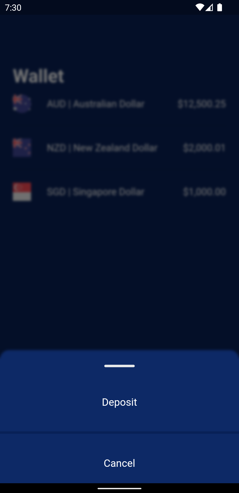
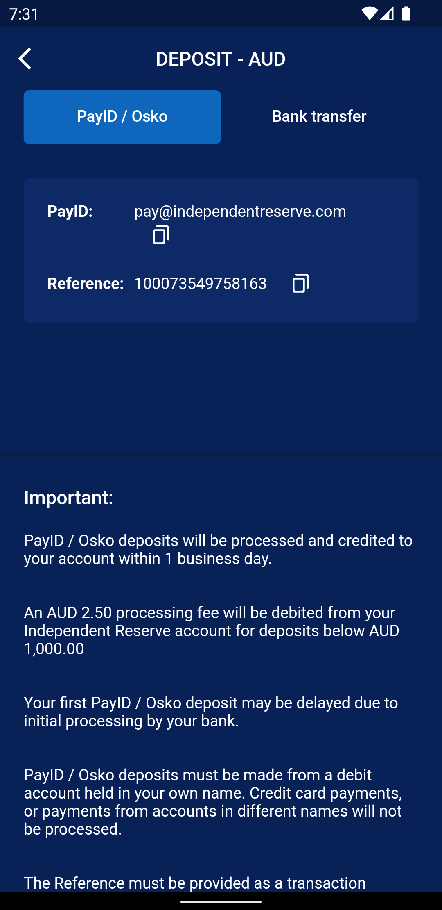

# Wallet

A Flutter Wallet app with Riverpod state management

Features:
- Riverpod
- Dio + Exception handler
- SVG
- Code generation
- Json annotation + serialization
- Bash script for code generation
- Api Test

## Getting Started

This is testing project for learning riverpod state management.

